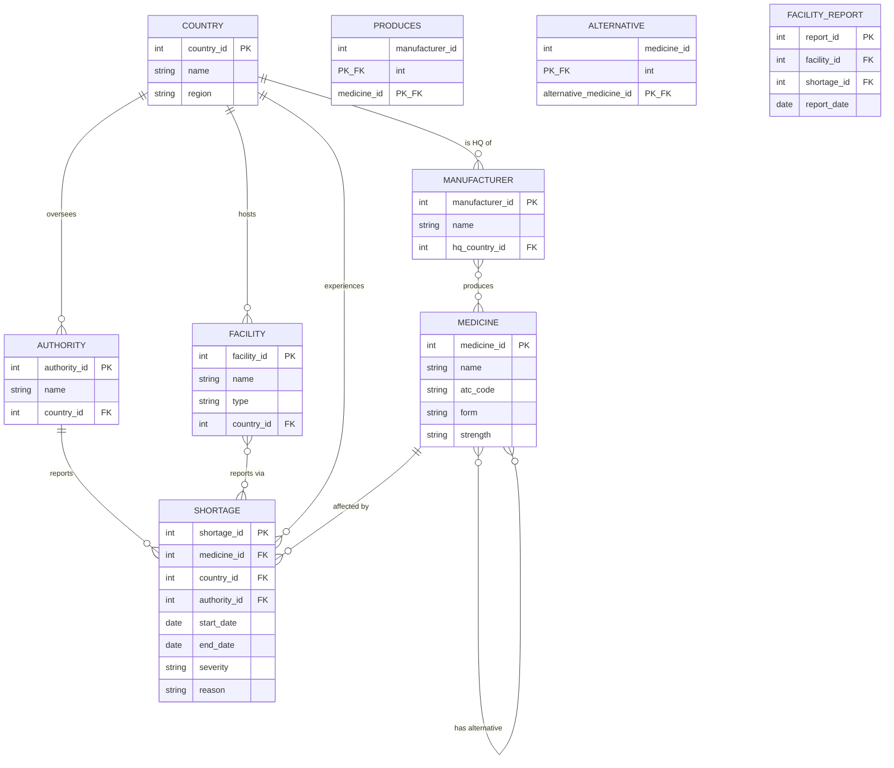

# Schema Design & Database Connection

KEN2110 Databases — Group Project, Assignment 3.

This repo picks up where the [Data Modelling assignment](#background) left
off: it turns the final ERD for our **EU Medicine Shortage Tracker** into a
working MySQL database, with real constraints, mock data, CRUD scripts, and
a set of advanced SQL queries.

## Background

**Scope.** The database lets health authorities and researchers track which
medicines are in shortage, in which EU countries, who manufactures them,
what alternatives exist, and how pharmacies/hospitals are experiencing the
shortage on the ground.

**Entities.** Country, Authority, Manufacturer, Medicine, Facility, Shortage,
plus three bridge tables: Produces (Manufacturer↔Medicine), Alternative
(Medicine↔Medicine) and Facility_Report (Facility↔Shortage).

## Entity-relationship diagram



This mirrors the final ERD from Assignment 2, arrived at by normalizing a
single flat table through 1NF, 2NF and 3NF (repeating manufacturer lists
split out into `PRODUCES`, partial dependencies on `medicine_name` moved
into `MEDICINE`, and transitive dependencies on authority details moved
into `AUTHORITY`).

The step from this diagram to the actual tables — every relation with its
primary key, foreign keys and referential actions — is written out in
[`sql/00_relational_schema.md`](sql/00_relational_schema.md).

## Repository structure

```
.
├── README.md                    this file
├── .env.example                 template for local DB credentials
├── sql/
│   ├── 00_relational_schema.md   the ERD written out as relations (PKs, FKs, referential actions)
│   ├── 01_schema.sql             DDL: database, tables, PKs/FKs, constraints
│   ├── 02_seed.sql               realistic mock data (EU countries, medicines, shortages, ...)
│   └── 03_advanced_queries.sql   5 advanced SQL queries (joins, aggregates, subqueries, window functions)
└── src/
    ├── requirements.txt          Python dependencies
    ├── db_config.py              database connection helper (reads .env)
    ├── db_operations.py          CRUD functions (create/read/update/delete)
    └── crud_demo.py              runnable script exercising the CRUD functions end-to-end
```

## Getting started

### 1. Prerequisites

- MySQL 8.0+ (or a compatible DBMS) installed and running locally
- Python 3.9+ (only needed for the CRUD demo scripts — the SQL files run
  standalone in any MySQL client)

### 2. Create the schema and load mock data

```bash
mysql -u root -p < sql/01_schema.sql
mysql -u root -p medicine_shortage_tracker < sql/02_seed.sql
```

### 3. Try the advanced queries

```bash
mysql -u root -p medicine_shortage_tracker < sql/03_advanced_queries.sql
```

Or open `sql/03_advanced_queries.sql` in your MySQL client of choice and run
the queries one at a time — each is commented with what it demonstrates.

### 4. Run the CRUD demo (optional)

```bash
cp .env.example .env        # then fill in your local MySQL credentials
cd src
pip install -r requirements.txt
python crud_demo.py
```

This inserts a medicine and a shortage, reads them back, updates them,
and deletes them again — leaving the database in its original seeded
state — to demonstrate basic `INSERT`/`SELECT`/`UPDATE`/`DELETE`
operations through parameterized queries.

## Constraints implemented

- Primary keys on every table (surrogate `AUTO_INCREMENT` ids for entities,
  composite keys for the `PRODUCES` and `ALTERNATIVE` bridge tables)
- Foreign keys on every relationship, with `ON DELETE`/`ON UPDATE` rules
  matched to the relationship (e.g. deleting a shortage cascades to its
  facility reports; deleting a country referenced by a facility is blocked)
- `NOT NULL` on required attributes
- `UNIQUE` constraints (e.g. one authority name per country, one medicine
  per name/form/strength combination — `form` and `strength` are `NOT NULL`
  so that key actually enforces uniqueness)
- `ENUM` constraints for controlled vocabularies (`facility.type`,
  `shortage.severity`)
- `CHECK` constraints for business rules (a shortage's `end_date` can't
  precede its `start_date`; a medicine can't be listed as its own
  alternative)

## Contributing

We use feature branches and pull requests for all changes — no direct
pushes to `main`. Each PR gets reviewed by at least one other team member
before merging, so we all stay familiar with the schema and queries.

## Team

Project Practical Assignment 25:

- Eduard Patachia
- Andrew Macari
- Isaac Tighe
- Mihály Kányási

All four of us have write access to this (public) repository.
