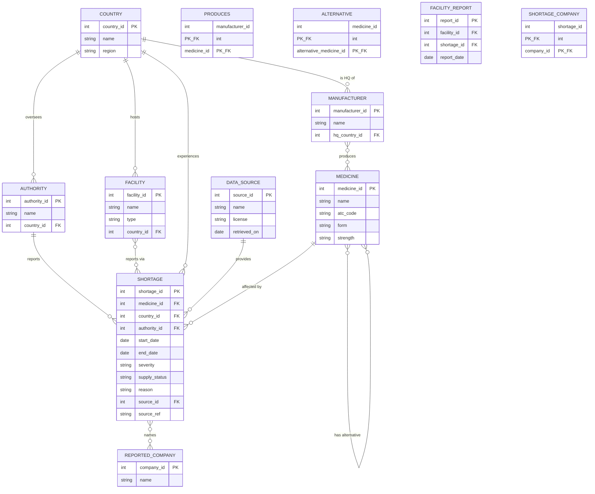

# EU Medicine Shortage Tracker

KEN2110 Databases — Group Project, Assignments 1–5.

This repository follows our project from the societal problem and ERD to a
working MySQL database. Assignment 5 adds real shortage data from the French
BDPM and openFDA, which we use as a comparison between two reporting systems.

## Project overview by week

| Week | Work completed | Where to find it |
|---|---|---|
| 1 | Defined medicine shortages as the societal problem and identified the stakeholders | [Background](#background) |
| 2 | Designed and normalized the ERD | [`docs/week2_data_modelling.md`](docs/week2_data_modelling.md) |
| 3 | Implemented the schema, constraints, mock data, CRUD operations, and advanced queries | [`sql/`](sql/) and [`src/`](src/) |
| 4 | Presented the database, example results, limitations, and future work | [Stakeholder video](docs/week4-stakeholder-video.mp4) and [transcript](docs/week4_video_transcript.md) |
| 5 | Integrated two real datasets and reran the Week 3 queries | [`sql/05_data_integration.md`](sql/05_data_integration.md) and [`docs/query_results.md`](docs/query_results.md) |
| Final | Added Q7-Q10, added authors to all queries and made the database dump for Zenodo | [Queries](#queries) and [Zenodo](#zenodo) |

## Background

**Scope.** The database lets health authorities and researchers track which
medicines are in shortage, in which EU countries, who manufactures them,
what alternatives exist, and how pharmacies/hospitals are experiencing the
shortage on the ground.

The societal problem was introduced in Week 1 using the Euronews article
[“EU medicine shortages at record levels, auditors report”](https://www.euronews.com/health/2025/09/17/eu-medicine-shortages-at-record-levels-auditors-report).
The main stakeholders are patients, pharmacies, hospitals, manufacturers and
distributors, national health authorities, and EU institutions such as the EMA.

**Entities.** Country, Authority, Manufacturer, Medicine, Facility, Shortage,
Data_Source, and Reported_Company. Bridge tables store the many-to-many
relationships.

## Entity-relationship diagram


```mermaid
erDiagram
    COUNTRY ||--o{ AUTHORITY : oversees
    COUNTRY ||--o{ FACILITY : hosts
    COUNTRY ||--o{ SHORTAGE : experiences
    COUNTRY ||--o{ MANUFACTURER : "is HQ of"
    AUTHORITY ||--o{ SHORTAGE : reports
    MEDICINE ||--o{ SHORTAGE : "affected by"
    MANUFACTURER }o--o{ MEDICINE : produces
    MEDICINE }o--o{ MEDICINE : "has alternative"
    FACILITY }o--o{ SHORTAGE : "reports via"
    DATA_SOURCE ||--o{ SHORTAGE : provides
    SHORTAGE }o--o{ REPORTED_COMPANY : names

    COUNTRY {
        int country_id PK
        string name
        string region
    }
    AUTHORITY {
        int authority_id PK
        string name
        int country_id FK
    }
    MANUFACTURER {
        int manufacturer_id PK
        string name
        int hq_country_id FK
    }
    MEDICINE {
        int medicine_id PK
        string name
        string atc_code
        string form
        string strength
    }
    FACILITY {
        int facility_id PK
        string name
        string type
        int country_id FK
    }
    SHORTAGE {
        int shortage_id PK
        int medicine_id FK
        int country_id FK
        int authority_id FK
        date start_date
        date end_date
        string severity
        string supply_status
        string reason
        int source_id FK
        string source_ref
    }
    PRODUCES {
        int manufacturer_id PK_FK
        int medicine_id PK_FK
    }
    ALTERNATIVE {
        int medicine_id PK_FK
        int alternative_medicine_id PK_FK
    }
    FACILITY_REPORT {
        int report_id PK
        int facility_id FK
        int shortage_id FK
        date report_date
    }
    DATA_SOURCE {
        int source_id PK
        string name
        string license
        date retrieved_on
    }
    REPORTED_COMPANY {
        int company_id PK
        string name
    }
    SHORTAGE_COMPANY {
        int shortage_id PK_FK
        int company_id PK_FK
    }
```

The original part of this diagram mirrors the final ERD from Assignment 2,
arrived at by normalizing a single flat table through 1NF, 2NF and 3NF.
Assignment 5 adds `DATA_SOURCE`, `REPORTED_COMPANY`, and `SHORTAGE_COMPANY` for
the real-data import.

The step from this diagram to the actual tables — every relation with its
primary key, foreign keys and referential actions — is written out in
[`sql/00_relational_schema.md`](sql/00_relational_schema.md).

## Repository structure

```
.
├── README.md                    this file
├── .env.example                 template for local DB credentials
├── data/
│   ├── dump/                    MySQL dump of the database for Zenodo
│   ├── raw/                     downloaded source snapshots and manifest
│   └── rejects/                 source rows that could not be integrated
├── docs/
│   ├── week2_data_modelling.md  Week 2 report with Assignment 5 update
│   ├── week4-stakeholder-video.mp4
│   ├── week4_video_transcript.md
│   └── query_results.md          results after loading the real data
├── sql/
│   ├── 00_relational_schema.md   the ERD written out as relations (PKs, FKs, referential actions)
│   ├── 01_schema.sql             DDL: database, tables, PKs/FKs, constraints
│   ├── 02_seed.sql               realistic mock data (EU countries, medicines, shortages, ...)
│   ├── 03_advanced_queries.sql   advanced SQL queries, adapted for real data
│   ├── 04_data_sources.sql       registers the two datasets
│   ├── 05_data_integration.md    Assignment 5 report
│   └── 06_validation.sql         row-count and constraint checks
└── src/
    ├── requirements.txt          Python dependencies
    ├── db_config.py              database connection helper (reads .env)
    ├── db_operations.py          CRUD functions (create/read/update/delete)
    ├── crud_demo.py              runnable script exercising the CRUD functions end-to-end
    ├── etl_download.py           downloads a fresh source snapshot
    ├── etl_clean.py              cleaning and transformation rules
    ├── etl_load.py               loads the cleaned data into MySQL
    ├── etl_test_clean.py         checks the cleaning rules
    └── run_queries.py            writes the query results to Markdown
```

## Getting started

### 1. Prerequisites

- MySQL 8.0.16+ installed and running locally (older 8.0 releases accept the
  `CHECK` constraints but silently do not enforce them)
- Python 3.9+ (only needed for the CRUD demo scripts — the SQL files run
  standalone in any MySQL client)

### 2. Create the schema and load mock data

```bash
mysql -u root -p < sql/01_schema.sql
mysql -u root -p medicine_shortage_tracker < sql/02_seed.sql
```

### 3. Try the advanced queries

```bash
mysql -u root -p medicine_shortage_tracker < sql/03_advanced_queries.sql
```

Or open `sql/03_advanced_queries.sql` in your MySQL client of choice and run
the queries one at a time — each is commented with what it demonstrates.

### 4. Load the real datasets for Assignment 5

The downloaded snapshot is already included in `data/raw`, so an internet
connection is not required for this step.

```bash
mysql -u root -p medicine_shortage_tracker < sql/04_data_sources.sql
cp .env.example .env        # then fill in local MySQL credentials
python -m pip install -r src/requirements.txt
python src/etl_test_clean.py
python src/etl_load.py --bdpm-update-date 28/09/2026
python src/run_queries.py
mysql -u root -p medicine_shortage_tracker < sql/06_validation.sql
```

Database credentials are read from `.env`; use `.env.example` as the template.
See the [real-data integration report](sql/05_data_integration.md) for the data
sources, licences, cleaning decisions, constraint checks, and results.

### 5. Run the CRUD demo (optional)

```bash
cp .env.example .env        # then fill in your local MySQL credentials
cd src
pip install -r requirements.txt
python crud_demo.py
```

This inserts a medicine and a shortage, reads them back, updates them,
and deletes them again — leaving the database in its original seeded
state — to demonstrate basic `INSERT`/`SELECT`/`UPDATE`/`DELETE`
operations through parameterized queries.

## Constraints implemented

- Primary keys on every table (surrogate `AUTO_INCREMENT` ids for entities,
  composite keys for the `PRODUCES` and `ALTERNATIVE` bridge tables)
- Foreign keys on every relationship, with `ON DELETE`/`ON UPDATE` rules
  matched to the relationship (e.g. deleting a shortage cascades to its
  facility reports; deleting a country referenced by a facility is blocked)
- `NOT NULL` on required attributes
- `UNIQUE` constraints (e.g. one authority name per country, one medicine
  per name/form/strength combination — `form` and `strength` are `NOT NULL`
  so that key actually enforces uniqueness)
- `ENUM` constraints for controlled vocabularies (`facility.type`,
  `shortage.severity`)
- `CHECK` constraints for business rules (a shortage's `end_date` can't
  precede its `start_date`; a medicine can't be listed as its own
  alternative)
- A composite foreign key ensures a shortage's country is the country of the
  authority that reported it
- Source references make the real-data import safe to run more than once
- `sql/06_validation.sql` tries inserts that break these rules and checks that
  MySQL rejects every one

## Queries

The queries are in `sql/03_advanced_queries.sql` and the results are in
`docs/query_results.md`. Each query has a comment saying who wrote it and why
it is relevant.

| Query | Question | Author (GitHub) | Why it matters |
|---|---|---|---|
| Q1 | Which countries have the most ongoing shortages? | EduardPatachia, updated by isaactighe and andriuhanfs | Shows where the problem is biggest |
| Q2 | Are the alternatives of a medicine in shortage also short in the same country? | EduardPatachia, updated by isaactighe and andriuhanfs | If the alternative is also short, patients can't switch |
| Q3 | Which manufacturers have shortages in more than one country? | EduardPatachia, updated by isaactighe and andriuhanfs | One country can't solve this on its own |
| Q4 | How long do resolved shortages last? | EduardPatachia, updated by isaactighe and andriuhanfs | Long shortages are harder to cover with stock |
| Q5 | Which facility reported each ongoing shortage most often? | EduardPatachia | Shows which hospitals and pharmacies are affected |
| Q6 | Which substances are short in both France and the US? | isaactighe, updated by andriuhanfs | These can't just be imported from the other country |
| Q7 | Which company groups have ongoing shortages in both France and the US? | marcellhoi4 | The same company has problems in more than one market |
| Q8 | Which ATC groups have the most ongoing shortages in France? | marcellhoi4 | Shows which treatment areas are hit hardest |
| Q9 | How long have ongoing shortages lasted in each country? | EduardPatachia | Shows if shortages are long-term |
| Q10 | What reasons are given for ongoing shortages? | EduardPatachia | The cause decides what can be done about it |

## Zenodo

The database dump for Zenodo is `data/dump/medicine_shortage_tracker.sql`. To
load it:

```bash
mysql -u root -p < data/dump/medicine_shortage_tracker.sql
```

We chose the CC BY 4.0 licence. The openFDA data is CC0, so it has no
conditions. The BDPM data uses the Licence Ouverte, which says you have to
cite the source and the update date, so we could not use CC0. CC BY 4.0 keeps
that requirement.

The dump has no personal data. Shortages are stored per medicine and not per
patient, the reported companies are all companies, and the facility names in
the seed data are made up. We also did not load the contact info field from
openFDA.

## Contributing

We use feature branches and pull requests for all changes — no direct
pushes to `main`. Each PR gets reviewed by at least one other team member
before merging, so we all stay familiar with the schema and queries.

## Team

Project Practical Assignment 25:

- Eduard Patachia (EduardPatachia)
- Andrew Macari (andriuhanfs)
- Isaac Tighe (isaactighe)
- Mihály Kányási (marcellhoi4)

All four of us have write access to this (public) repository.
